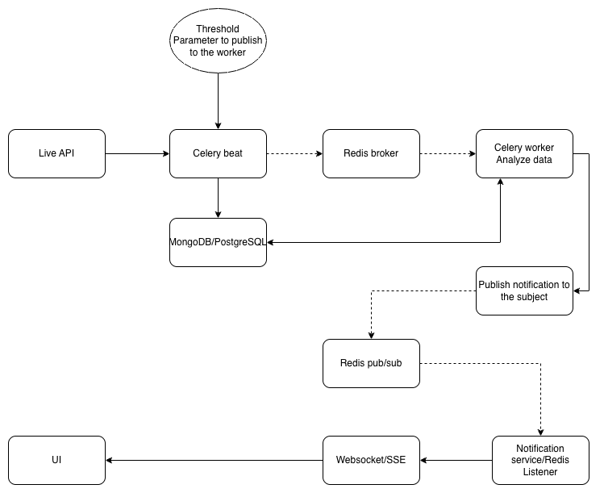

# Scaffold for Celery Beat and Event-Driven SSE (FastAPI + React)

This scaffold demonstrates an **event-driven microservice setup** using:

- **FastAPI** — backend API with Server-Sent Events (SSE)
- **Celery + Celery Beat** — distributed task processing and scheduling
- **Redis** — message broker
- **MongoDB** — database for persistent storage
- **React (Vite)** — frontend for live updates

---

## Architecture Overview



## Project structure

```txt
.
├── architecture.png
├── backend
│   ├── app
│   │   ├── __init__.py
│   │   ├── celery_app.py
│   │   ├── config.py
│   │   ├── database.py
│   │   ├── main.py
│   │   ├── models.py
│   │   ├── sse_manager.py
│   │   └── tasks.py
│   ├── Dockerfile
│   └── requirements.txt
├── docker-compose.yml
├── frontend
│   ├── Dockerfile
│   ├── package-lock.json
│   ├── package.json
│   ├── public
│   │   └── index.html
│   └── src
│       ├── api.js
│       ├── App.js
│       ├── components
│       │   ├── Dashboard.js
│       │   └── LiveUpdates.js
│       └── index.js
└── README.md

```

## Getting Started with Podman (or Docker)

clone the git repository to start

```sh
git clone git@github.com:hitalukder/celery_beat_event_driven_sse_scaffold.git
cd celery_beat_event_driven_sse_scaffold
```

### Build and Start All Services

```bash
podman compose up --build -d
```

| Service           | Description                       |     Port |
| ----------------- | --------------------------------- | -------: |
| **backend**       | FastAPI backend (SSE endpoint)    |   `8000` |
| **frontend**      | React frontend (served via Nginx) |   `3000` |
| **celery_worker** | Celery worker for background jobs | internal |
| **celery_beat**   | Celery scheduler (periodic jobs)  | internal |
| **redis**         | Message broker for Celery         |   `6379` |
| **mongo**         | MongoDB database                  |  `27017` |

### Access the Application

- Backend (API): http://localhost:8000
- Live Events: http://localhost:8000/events

### Running Frontend in Development Mode

```bash
cd frontend
npm install
npm start
```

Frontend: http://localhost:3000

